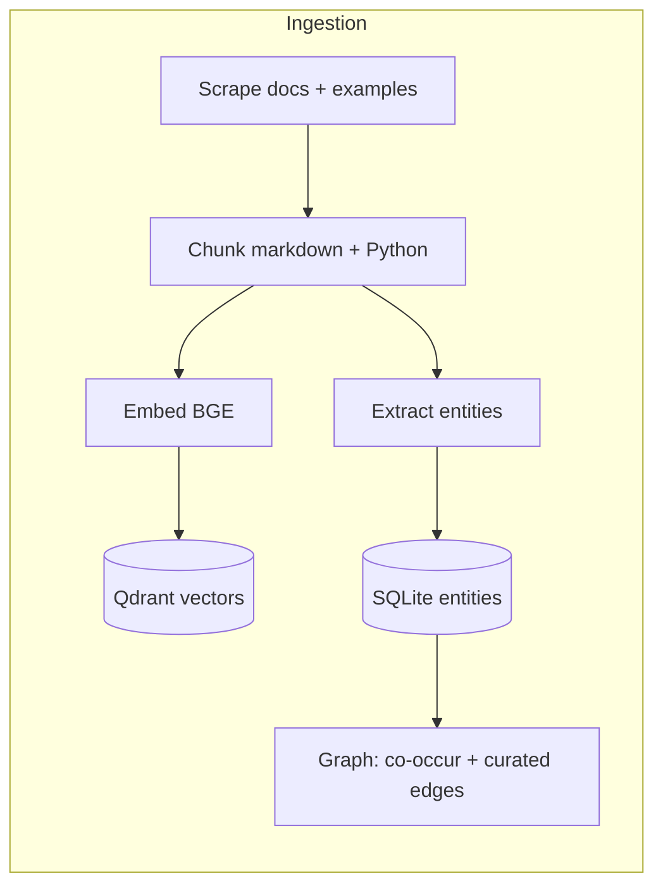
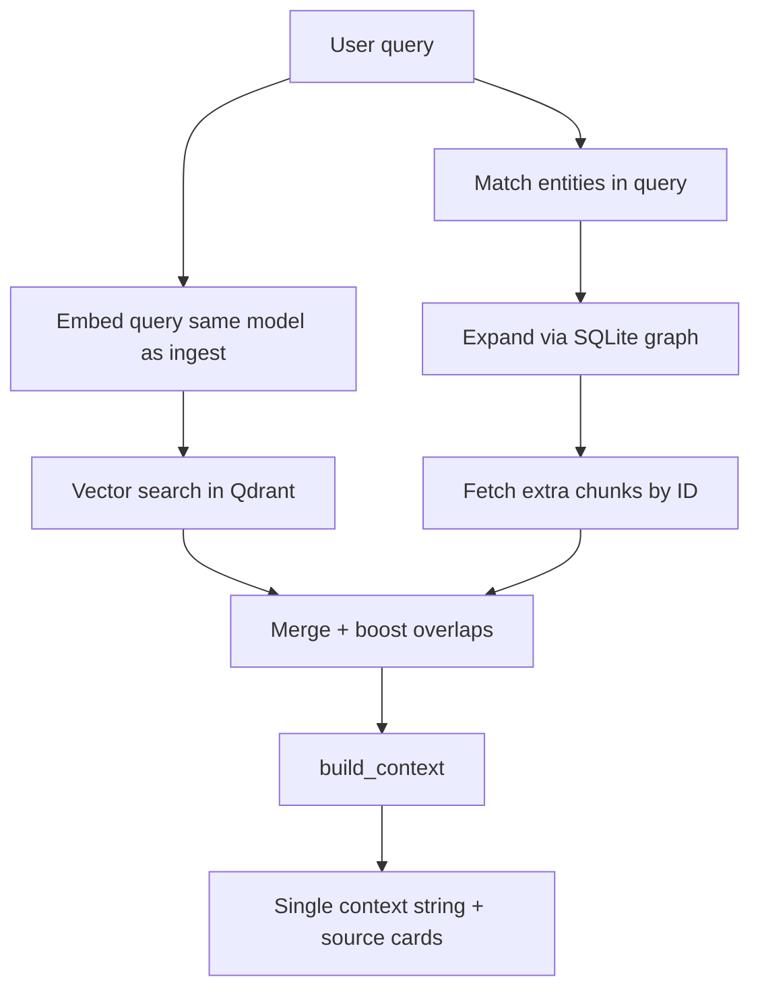
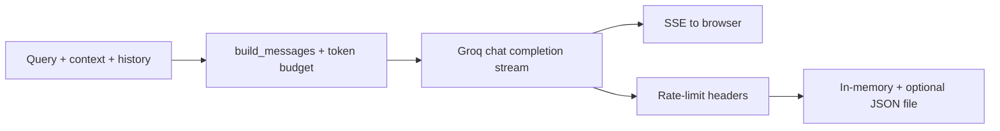

# PySparkAssist

PySparkAssist scrapes official-ish documentation and Spark examples, stuffs them into a vector database, keeps entity relationships in SQLite, and answers questions with a small LLM (via [Groq](https://groq.com)) that is *required* to cite what it retrieved.

I built it because I wanted a tool I’d actually use while learning PySpark and because something like this on the CV might help with the AI engineer roles that keep rejecting me.

---

## Features

- **Grounded answers** from retrieved chunks
- **Hybrid retrieval**: dense search in Qdrant + optional boosts from a tiny **entity graph**
- **Streaming chat** over SSE, with **Groq rate-limit transparency**
- **Local-first data plane**: embeddings and vectors stay on disk
- A **frontend** that’s one HTML file, one JS file, and enough Tailwind

---

## Deployment

**Idea:** build search data **on the host** with a normal Python venv (ingest needs Playwright, `git`, and time). Run the **API in Docker** using that same `data/` tree on a volume — the image stays smaller and does not run ingestion.

### 1. Clone and configure

```bash
git clone https://github.com/Aanjney/PySparkAssist.git
cd PySparkAssist
cp env.example .env
# Edit .env: GROQ_API_KEY, GROQ_MODEL, EMBEDDING_MODEL, paths (default ./data/... for local work)
```

### 2. Ingest (local venv, whenever you need fresh data)

```bash
python -m venv venv && source venv/bin/activate   # Windows: venv\Scripts\activate
pip install -r requirements.txt
python -m playwright install-deps chromium && python -m playwright install chromium
python -m pysparkassist.ingest run
```

This fills **`./data/`** (Qdrant files, `graph.db`, raw scrape, cached embedding weights). Run from the repo root.

### 3. Run the API locally (optional)

```bash
python -m pysparkassist
# → http://localhost:8000
```

### 4. Run with Docker

The **`Dockerfile`** installs only **`requirements-runtime.txt`** (no crawl4ai / Playwright). **Mount your existing `./data`** into the container at **`/app/data`** and point env paths at `/app/data/...` (see `env.example` comments or duplicate `.env` with Docker paths).

```bash
docker build -t pysparkassist:local .
docker run --rm -p 8000:8000 --env-file .env \
  -v "$(pwd)/data:/app/data" \
  pysparkassist:local
```

If `.env` still uses `./data/...`, override for Docker, e.g. `QDRANT_PATH=/app/data/qdrant`, `SQLITE_PATH=/app/data/graph.db`, etc.

On a VPS, app clone often lives under `~/services/<name>/` with Compose + Caddy under `~/deploy/` (infra templates may live outside this repo).

---

## Project structure

```text
PySparkAssist/
├── Dockerfile
├── requirements.txt           # full stack (local dev + ingest)
├── requirements-runtime.txt   # API-only deps for Docker
├── env.example
├── frontend/
├── pysparkassist/
│   ├── api/
│   ├── config.py
│   ├── generation/
│   ├── ingest/
│   ├── retrieval/
│   └── __main__.py
└── README.md
```

---

## Ingestion strategy

Offline pipeline: turn docs and example code into searchable vectors plus a small entity graph.




**In short:** scrape once, chunk by headings / code structure, embed with the same model you’ll use at query time, store vectors in Qdrant, store entities and relationships in SQLite so retrieval can go beyond pure similarity.

**Why these choices**


| Choice                     | Upside                                             | Tradeoff                                                              |
| -------------------------- | -------------------------------------------------- | --------------------------------------------------------------------- |
| **Local Qdrant + SQLite**  | Simple deploy                                      | Maybe too simple idk                                                  |
| **Chunking heuristics**    | Fast, deterministic, good enough for docs/examples | Not semantic segmentation; occasional awkward splits                  |
| **Entity graph as add-on** | Cheap signal for related APIs and examples         | Maintenance of seeds + heuristics; not a full knowledge graph product |
| **Separate ingest CLI**    | Heavy work isn’t on the request path               | Additional step                                                       |


---

## Retrieval strategy

Turn a user question into a tight context block (and source metadata) for the LLM.




**In short:** dense search does the heavy lifting; if the query mentions known entities, the graph can pull in related chunks. Overlaps get a small score boost so “found by vector and graph” ranks higher.

**Tradeoffs**

- **Speed vs depth:** chunk count is capped so latency stays tolerable.
- **Recall vs noise:** graph expansion can add odd neighbors; merge/scoring trims most of that.
- **No live web:** freshness is whatever the last ingest was.

---

## Generation strategy

Groq streams tokens; the app keeps the model inside PySpark + retrieved context.




**In short:** one system prompt (scope, citations, no fake URLs, sane code fences), truncate context/history to fit budget, stream over SSE, map errors to user-safe messages, refresh shared Groq quota from response headers (and optional startup `models.list` probe).

**Tradeoff:** tuned for **learner-friendly, grounded answers**, not for open-ended “build whole ETL” codegen.

---

## Frontend

- **Alpine.js** for reactive UI (chat, dark mode, usage panel).
- **Tailwind** via CDN (no bundler).
- **marked** for markdown; **highlight.js** for fenced code (highlighting runs when markdown is parsed so streaming doesn’t show raw backticks for long).
- **DOMPurify** on rendered HTML before `innerHTML`.
- **SSE** (`fetch` + `ReadableStream`) for chat tokens; **polling** `/api/limits` for Groq usage (no WebSocket).
- **localStorage** for dark mode preference.

---

## Configuration

See **`env.example`** for variables (paths, `GROQ_*`, embedding model, rate limits, etc.).

Runtime data lives under **`./data/`** at the repo root by default (Qdrant, SQLite graph, cached embedding weights, `groq_limits.json`). Docker expects that directory mounted at **`/app/data`** with matching paths in env.

---

## License

See [LICENSE](LICENSE).
