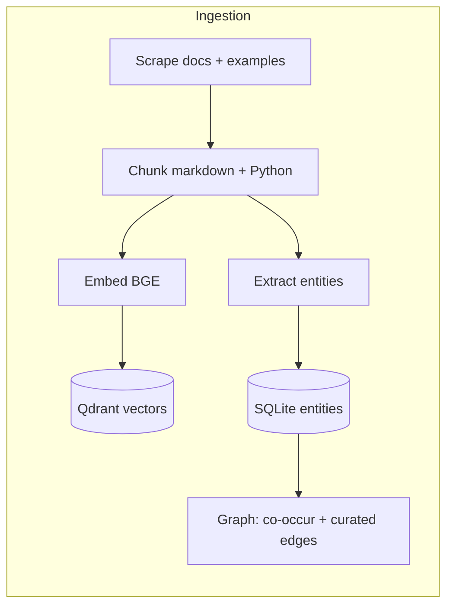
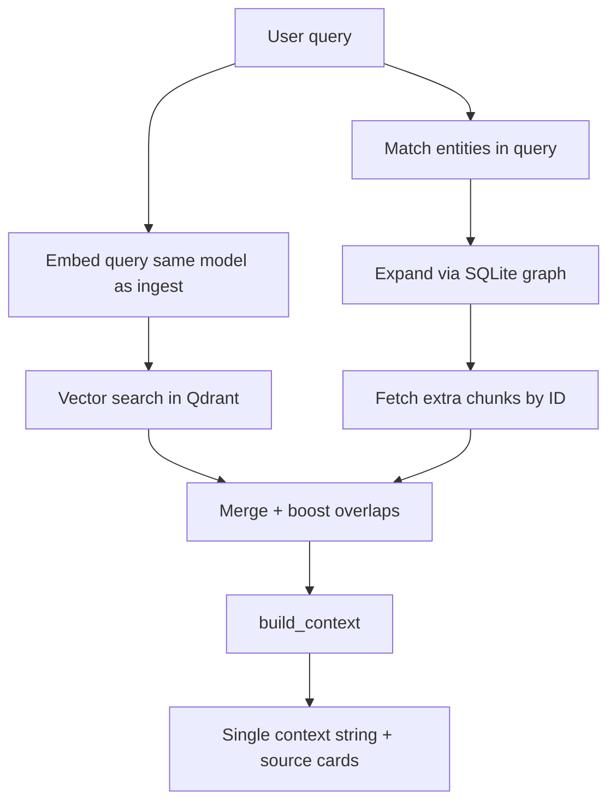
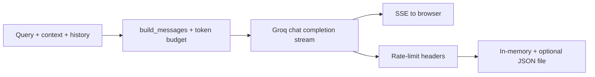

# PySparkAssist

**RAG-powered PySpark help that actually reads the docs.**  
PySparkAssist scrapes official-ish documentation and Spark examples, stuffs them into a vector database, whispers entity relationships into SQLite, and answers questions with a small LLM (via [Groq](https://groq.com)) that is *required* to cite what it retrieved.

---

## Features

- **Grounded answers** from retrieved chunks
- **Hybrid retrieval**: dense search in Qdrant + optional boosts from a tiny **entity graph**
- **Streaming chat** over SSE, with **Groq rate-limit transparency**
- **Local-first data plane**: embeddings and vectors stay on disk
- A **frontend** that’s one HTML file, one JS file, and enough Tailwind

---

## Quick start

```bash
git clone https://github.com/Aanjney/PySparkAssist.git
cd PySparkAssist
python -m venv venv && source venv/bin/activate
pip install -e ".[dev]"
cp .env.example .env
# Edit .env: GROQ_API_KEY, paths if needed, GROQ_MODEL, EMBEDDING_MODEL
```

**Ingest** (downloads, chunks, embeds):

```bash
python -m pysparkassist.ingest run
```

**Run the API + static UI**:

```bash
python -m pysparkassist
# or: uvicorn pysparkassist.api.app:create_app --factory --host 0.0.0.0 --port 8000
```

App runs on `http://localhost:8000`.

---

## Project structure

```text
PySparkAssist/
├── frontend/                 # Alpine.js + Tailwind
├── pysparkassist/
│   ├── api/                  # FastAPI app, routes, IP rate limiter, Groq limits file store
│   ├── config.py             # Settings from env (.env)
│   ├── generation/           # System prompt, Groq streaming client
│   ├── ingest/               # Scrape → chunk → embed → entity graph
│   ├── retrieval/            # Query processing, search, graph expand, context packager
│   └── __main__.py           # uvicorn entrypoint
├── tests/
├── pyproject.toml
└── README.md
```

---

## Ingestion strategy

Offline pipeline: turn docs and example code into searchable vectors plus a small entity graph.




**In short:** scrape once, chunk by headings / code structure, embed with the same model you’ll use at query time, store vectors in Qdrant, store entities and relationships in SQLite so retrieval can go beyond pure similarity.

**Why these choices**


| Choice                     | Upside                                             | Tradeoff                                                              |
| -------------------------- | -------------------------------------------------- | --------------------------------------------------------------------- |
| **Local Qdrant + SQLite**  | Simple deploy                                      | None                                                                  |
| **Chunking heuristics**    | Fast, deterministic, good enough for docs/examples | Not semantic segmentation; occasional awkward splits                  |
| **Entity graph as add-on** | Cheap signal for related APIs and examples         | Maintenance of seeds + heuristics; not a full knowledge graph product |
| **Separate ingest CLI**    | Heavy work isn’t on the request path               | Additional step                                                       |


---

## Retrieval strategy

Turn a user question into a tight context block (and source metadata) for the LLM.




**In short:** dense search does the heavy lifting; if the query mentions known entities, the graph can pull in related chunks. Overlaps get a small score boost so “found by vector and graph” ranks higher.

**Tradeoffs**

- **Speed vs depth:** chunk count is capped so latency stays tolerable.
- **Recall vs noise:** graph expansion can add odd neighbors; merge/scoring trims most of that.
- **No live web:** freshness is whatever the last ingest was.

---

## Generation strategy

Groq streams tokens; the app keeps the model inside PySpark + retrieved context.




**In short:** one system prompt (scope, citations, no fake URLs, sane code fences), truncate context/history to fit budget, stream over SSE, map errors to user-safe messages, refresh shared Groq quota from response headers (and optional startup `models.list` probe).

**Tradeoff:** tuned for **learner-friendly, grounded answers**, not for open-ended “build whole ETL” codegen.

---

## Frontend

- **Alpine.js** for reactive UI (chat, dark mode, usage panel).
- **Tailwind** via CDN (no bundler).
- **marked** for markdown; **highlight.js** for fenced code (highlighting runs when markdown is parsed so streaming doesn’t show raw backticks for long).
- **DOMPurify** on rendered HTML before `innerHTML`.
- **SSE** (`fetch` + `ReadableStream`) for chat tokens; **polling** `/api/limits` for Groq usage (no WebSocket).
- **localStorage** for dark mode preference.

---

## Configuration

See `.env.example` for variables (paths, `GROQ_`*, embedding model, rate limits, optional `GROQ_LIMITS_STARTUP_PROBE`, etc.).

Runtime data lives under `/data/` at the repo root by default (Qdrant, SQLite graph, cached embedding weights, `groq_limits.json`).

---

## License

See [LICENSE](LICENSE).